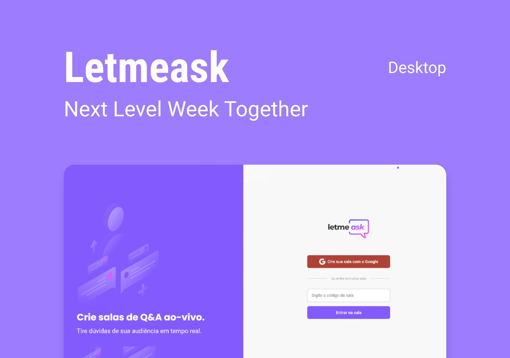

<p align="center">
  
</p>

<p align="center">
  <a href="#-technologies">Technologies</a>&nbsp;&nbsp;&nbsp;|&nbsp;&nbsp;&nbsp;
  <a href="#-project">Project</a>&nbsp;&nbsp;&nbsp;|&nbsp;&nbsp;&nbsp;
  <a href="#-layout">Layout</a>&nbsp;&nbsp;&nbsp;|&nbsp;&nbsp;&nbsp;
  <a href="#-how-to-run">How to run</a>&nbsp;&nbsp;&nbsp;|&nbsp;&nbsp;&nbsp;
  <a href="#-license">License</a>
</p>

<p align="center">
  

     
</p>

<h1 align="center">
  
</h1>

<br>

## 🧪 Technologies

This project was developed with the following technologies:

- [React](https://reactjs.org)
- [Firebase](https://firebase.google.com/)
- [TypeScript](https://www.typescriptlang.org/)

## 💻 Project

Letmeask is perfect for content creators to create Q&A rooms with their audience in a very organized and democratic way.

This is a project developed during the **[Next Level Week Together](https://nextlevelweek.com/)**, presented from the 20th to the 27th of June 2021.

## 🔖 Layout

You can view the project layout through the link below:

- [Layout Web](https://www.figma.com/file/Vmnblz3jCz2YZ40lCMZzkJ/Letmeask?node-id=45%3A3278)

Remembering that you need to have an account on [Figma](http://figma.com/).

## 🚀 How to run

Clone the project and access its folder.

```bash
$ git clone https://github.com/thefalked/letmeask
$ cd letmeask
```

To start it, follow the steps below:

```bash
# Install dependencies
$ yarn

# Start the project
$ yarn start
```

The app will be available in your browser by address `http://localhost:3000`.

Remembering that it will be necessary to create an account in [Firebase](https://firebase.google.com/) and a project to make a Realtime Database available.

## 📝 License

This project is under the MIT license. See the [LICENSE](LICENSE.md) file for more details.
